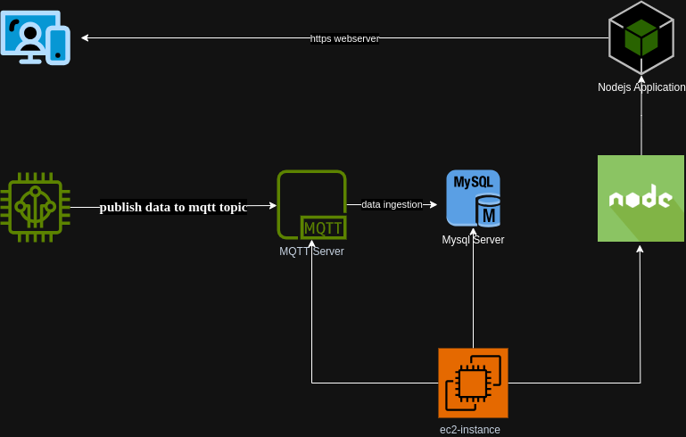

---

# ESP32-based Temperature and Humidity Monitoring System

This project demonstrates a complete IoT setup for monitoring temperature and humidity using an ESP32-based M5 Atom microcontroller with a DHT11 sensor. Data is sent to a Mosquitto MQTT broker running on an AWS EC2 instance, ingested into a MySQL database, and displayed through a Node.js web server using SSL for secure communication.

## System Overview

- **ESP32 M5 Atom Controller**: Reads temperature and humidity data from a DHT11 sensor and publishes it to the MQTT broker.
- **Mosquitto MQTT Broker**: Hosted on AWS EC2, receives data from ESP32, and relays it to the web server and database.
- **MySQL Database**: Stores temperature and humidity data from the MQTT broker.
- **Node.js Web Server**: Displays sensor data on a webpage, interacts with the MQTT broker and MySQL database.

## Prerequisites

- An AWS account with an EC2 instance.
- A registered domain name for SSL configuration.
- ESP32 M5 Atom microcontroller with a DHT11 sensor.
- Basic knowledge of MQTT, Node.js, and MySQL.

## Architechture

## Components

1. **AWS EC2 Instance**: Running Ubuntu 20.04 with the Mosquitto MQTT broker, MySQL server, and Node.js web server.
2. **Mosquitto MQTT Broker**: Installed on EC2 and configured with SSL.
3. **MySQL Server**: Running on EC2, secured with SSL.
4. **Node.js Web Server**: Serves a webpage to display sensor data, secured with SSL.
5. **ESP32 M5 Atom**: Programmed to read data from the DHT11 sensor and publish it to the MQTT broker.

## Setup and Configuration

### Step 1: Launching the EC2 Instance

1. Create a `t2.micro` EC2 instance using Ubuntu Server 20.04 LTS.
2. Configure the instance with necessary security groups to allow SSH, MQTT, and HTTP/HTTPS traffic.

### Step 2: MQTT Broker Installation and Configuration

1. Install the Mosquitto MQTT broker on the EC2 instance.
2. Configure the broker for SSL communication using a certificate (e.g., from Let's Encrypt).

### Step 3: Device Configuration and Testing

1. Connect the DHT11 sensor to the ESP32 M5 Atom.
2. Program the ESP32 to send temperature and humidity data to the MQTT broker over SSL.
3. Test the data transmission to the MQTT topic.

### Step 4: Database and Web Server Setup

1. Install MySQL on the EC2 instance and secure it with SSL.
2. Create a database schema for storing temperature and humidity data.
3. Install Node.js and set up a web server to retrieve data from MySQL and display it on a webpage.
4. Secure the web server with SSL for HTTPS communication.

### Step 5: Data Visualization and Real-Time Updates

1. Implement data visualization features on the Node.js web server.
2. Use technologies like WebSocket or AJAX for real-time updates.

## Usage

Once fully set up, the ESP32 reads temperature and humidity data, sends it to the MQTT broker, which then relays this data to the MySQL database. The Node.js server accesses this data and displays it on a webpage.

## Possible Enhancements

- Implement advanced data visualization for historical data analysis.
- Ensure robust security practices across all components.
- Develop a backup and recovery plan for the database.

## Conclusion

This project provides a robust framework for IoT-based temperature and humidity monitoring, leveraging AWS EC2, MQTT, MySQL, and Node.js for a full-stack IoT solution.

---
